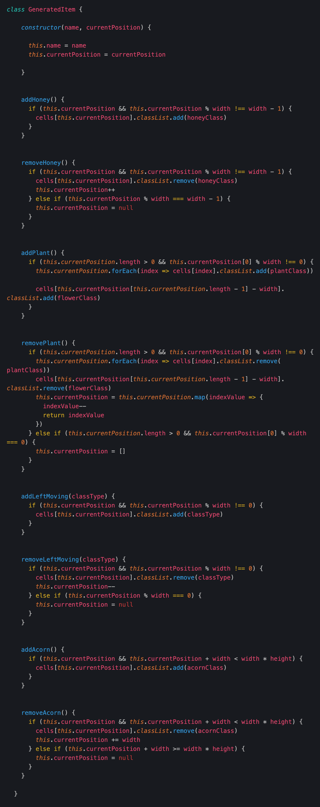

# American Were-Bee in London
project-1

# The Brief

The project brief was to create a game that used a grid as the environment for gameplay.

Of the examples to games suggested to create, space invaders, tetris and frogger intrigued me most.

I wondered if I could combine concepts from all of these into one game. Obstacle avoidance, gravity, projectiles, point scoring. Then add an autoscroll.

# The Build

Creating a grid was the first step. Defining a width and height in Javascript and using a for loop to add divs through the DOM means a quick change to size can be applied in javascript instead of hard coding individual divs in html.
With this built all divs ('cells') are accessed with arguements related to the width/height.

By adding and removing classes with different background images it can look like an item is moving through the grid.

With this in place I conceptualised rough ideas and noted ways it might be possible to realise that idea.

My process was to add individual pieces to test the theory then expand on it. Starting from making one thing autoscroll very quickly changes to multiples.

One of the big initial steps was to create the plants. These span a number of 'cells' and need to be accessed as a single unit. Dropping them into arrays was no problem. It was just a little trickier to move them than a single cell.

The Protaganist
With a grid built and some classes to test the method my main character scale seemed a little off. With the method of controlling an array fine-tuned from my plant test I changed the main character from a single cell to an array and added an img element to position[0].

With building and testing individual components it became clear that each moving element had the same key features to control it. I built a new Class for generated components, created a number of each and applied them to arrays.

With this is place I could control the whole area with array methods.

# Fine Tuning / Wins

At first my collision detection to remove lives was just 'if there is a certain CSS style class attached to any of my bee position then remove a life'.

To add complexity and apply the same principles to remove 'enemies' when hit by projectiles I needed to know which enemy was hit or which enemy hit the main character.

 I used array methods to cycle through the arrays of each extract the duplicates and remove the specific enemy.

# Styling

The style is deliberately cartoonish as I felt attempting to apply realistic visual could detract from the game.

The title and story explained in the how to are an amusing step away from the jovial nature of the game.

For the screens/cards Html elements are accessed through the DOM - styled in CSS and have a 'hidden' class toggled as needed.

# Future Improvements

With more time I would have liked to add a leaderboard using the localStorage.

I would like to have gradually increased the speed of scroll to increase difficulty as time prgressed and add random bursts of wasps.

A 'boss' character that enters after a certain period of time, needs to be struck a set number of times and who moves in 2 dimensions - similar to the main character.

# How to Play

You are an American Were-Bee in London. You only have two thirsts; pollen & revenge!

Navigate around London's gardens using the arrow keys looking to quench these thirsts.

Flowers are a great source of pollen. The longer you spend on a flower the more pollen you collect! Be careful not to touch their stems, they are dangerous to were-bees!

You will also find a great deal of pollen has been stirred up into the air at this time of year.

Be on the look out for the vampire wasps that massacred your colony. 

It's a well known fact that acorns sided with the vampires in the war.

When you see either you can fire your garlic-honey infusion with the SPACE bar. Let them taste your vengeance.

Make sure you are actively flying! You're a little chunkier than you used to be so you'll find yourself starting to drop if you stop flying.

You don't want to get too low. Someone seems to have spilled London tap water on the grass as it's laced with quicksilver - instantly deadly!