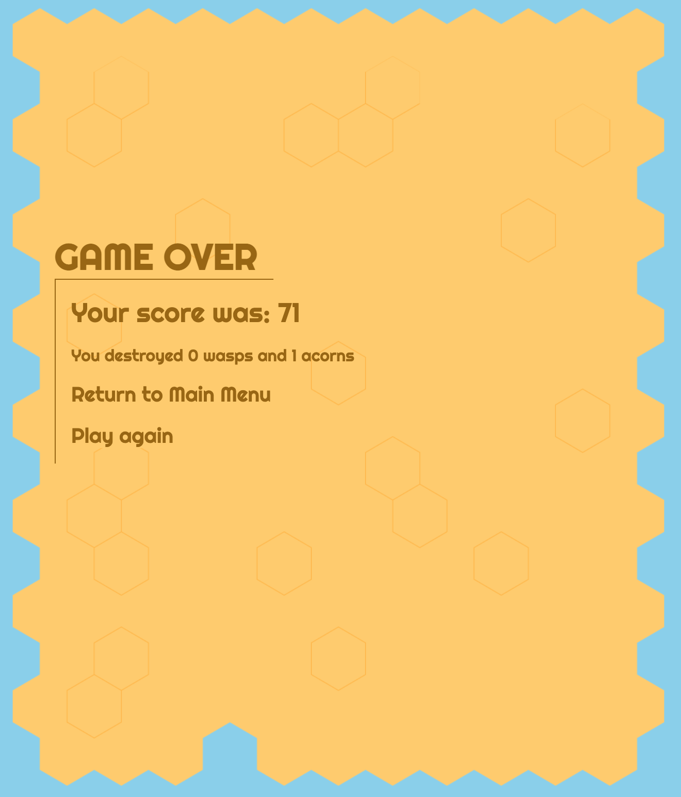

# American Were-Bee in London
Software Engineering Immersive Course || Project-1 || Individual Project || 1 week
 
<p align="center" >
 
</p>
 
[American Were-Bee in London - Deployed Game](https://richardknight88.github.io/project-1/)
 
<p align="center" >
 
</p>
 
## Table of Contents
[The Brief](#the-brief) <br>
[The Build](#the-build) <br>
[Code Examples](#code-examples) <br>
[Wins](#wins) <br>
[Challenges](#challenges) <br>
[Bugs](#bugs) <br>
[Styling](#styling) <br>
[Future Improvements](#future-improvements) <br>
[Key Learnings](#key-learnings) <br>
[How To Play](#how-to-play) <br>

 
 
## The Brief
 
The project brief was to create a game that used a grid as the environment for gameplay.
 
Of the example games suggested to create, Space invaders, Tetris, Pacman and Frogger intrigued me most.
 
I wondered if I could combine concepts from all of these into one game. Obstacle avoidance, 'gravity', projectiles, point scoring.
 
Then add an autoscroll.
<br>
 
## The Build

I started by pseudo-coding a rough plan detailing components of the game and how I might implement these.

I decided that the grid and main character were the initial pieces of the puzzle before working up to adding point scorers and life takers.

Creating a grid was the first step. Defining a width and height in JavaScript and using a for loop to add divs through the DOM means a quick change to size can be applied in JavaScript instead of hard coding individual divs in HTML.
With this built all divs ('cells') are accessed with arguments related to the width and/or height variables.
 
By adding and removing classes with different background images it gives the impression that an item is moving through the gameplay environment.
 
My process was to add individual components to test the theory before expanding on this. Starting from making one thing autoscroll very quickly changes to multiple components and automation.
 
One of the big initial steps was to create the 'plants' - stems topped by a flower. These span a number of 'cells' and need to be accessed as a single unit. Dropping them into arrays was no problem and after this it was just a little trickier to move them as a single cell.
<br>
 
 
### Our Protagonist || The Were-Bee
With a gameplay environment and some moving components there was an issue with the scale of the main character. The lessons learned in fine-tuning control of a 'plant' could be applied here. An `````` element of the bee applied to the first index of the position array meant the bee could be much larger and be the focus of the game.
<br>
 
 
## Code Examples
By creating a new Object Class for the automatically generated components, different functions could be defined to update the position of each item based on the relevant movement of that item through the game play environment.
 
As an example, 'wasps', 'pollen' and 'lives' all move right-to-left through the gameplay environment. Building the functions as below allowed me to reuse these functions.
 
The ```removeLeftMoving``` function is a check to see if the item is at the left hand end of the game play area. If not, the item class is removed and the position is updated.
If it is at the left hand edge then the position is set to null.
The ```addLeftMoving``` function checks if a position exists and whether it is at the left hand edge to see if it should add the item class.
 
 
```js
 
 addLeftMoving(classType) {
   if (this.currentPosition && this.currentPosition % width !== 0) {
     cells[this.currentPosition].classList.add(classType)
   }
 }
 
 
 removeLeftMoving(classType) {
   if (this.currentPosition && this.currentPosition % width !== 0) {
     cells[this.currentPosition].classList.remove(classType)
     this.currentPosition--
   } else if (this.currentPosition % width === 0) {
     this.currentPosition = null
   }
 }
 
```
 
At set intervals new items would be generated and added to arrays. The movement of all of these items could be controlled with array methods like below.
 
```js
 
function scrollStart() {
 if (!scrolling) {
   scrolling = setInterval(() => {
 
     plantArray.forEach(plant => {
       plant.removePlant()
       plant.addPlant()
     })
 
 
     pollenArray.forEach(pollen => {
       pollen.removeLeftMoving(pollenClass)
       pollen.addLeftMoving(pollenClass)
     })
 
 
     lifeArray.forEach(life => {
       life.removeLeftMoving(livesFullClass)
       life.addLeftMoving(livesFullClass)
     })
 
   }, scrollTimer)
 } else {
   clearInterval(scrolling)
   scrolling = null
 }
}
 
```
<br>
 
 
## Wins
 
Creating what is almost a fully functioning game in a week is the biggest win. The approach of trying and testing little bits at a time meant that there were regular satisfying breakthroughs.
 
One of the most satisfying of these was the function that found which 'enemy' had been hit by a honey projectile and removed it from the array.
 
The initial function simply cycled through the 'honey' array and checked if any of the current positions also had an 'enemy' item class applied.
 
This developed into the below function that could be passed different 'enemy' arrays and classes.
 
Working step by step to ensure the information being returned was what was expected - the function would combine the arrays and return only 'true' values.
These values were then placed in another array to cycle through to search for duplicates.
The duplicate values would be plugged into the original honey and 'enemy' arrays where the item classes would be removed.
A temporary 'combined' class would be added then quickly removed and a score relative to the 'enemy' class updated.
 
 
```js
 
function honeyCheck(arr1, arr2, class1, class2) {
 
 const mergedArray = arr1.concat(arr2)
 
 const filteredArray = mergedArray.filter(item => {
   if (item.currentPosition) {
     return item.currentPosition
   }
 })
 
 const positionsArrray = filteredArray.map(item => item.currentPosition)
 
 const uniqueArray = []
 const duplicates = []
 
 positionsArrray.filter(item => {
   if (uniqueArray.indexOf(item) < 0) {
     uniqueArray.push(item)
   } else {
     duplicates.push(item)
   }
 })
 
 duplicates.forEach(item => {
   for (let i = 0; i < arr1.length; i++) {
     if (arr1[i].currentPosition === item) {
       arr1[i].currentPosition = null
       cells[item].classList.remove(class1)
       cells[item].classList.add(honeySplatClass)
       setTimeout(() => {
         cells[item].classList.remove(honeySplatClass)
       }, 100)
     }
   }
   for (let i = 0; i < arr2.length; i++) {
     if (arr2[i].currentPosition === item) {
       arr2[i].currentPosition = null
       cells[item].classList.remove(class2)
     }
   }
 
   scoreUpdate(class2)
 })
 
}
 
```
 
## Challenges
 
The scale of the project - creating an original game with multiple screens - was a massive challenge.
 
Within this, the most difficult aspect was controlling the multiple intervals - particularly the 'collision detection'.
 
With the bee collision interval I had set a timeout period after a collision where you cannot be hit again. This worked  with 'wasp' and 'acorn' classes as they would be removed after the collision.
The main issue was collisions with a plant stem as the plant stems were not removed after a collision. There would be regular instances of the timeout never initialising and therefore several collisions being detected.
To resolve this I implemented a boolean toggle that the ```startCollisionCheck``` function was dependent on. This 'switch' being almost instantaneous allowed the ```setTimeout``` to execute properly and removed the bug.
 
```js
 
function toggleCollision(classType) {
 if (classType === waspClass || classType === plantClass || classType === acornClass) {
   beePic.classList.toggle('collision')
   updateLives(classType)
   canCheckCollision = false
   setTimeout(() => {
     canCheckCollision = true
     beePic.classList.toggle('collision')
     startCollisionCheck()
   }, 1000)
 } else {
   updateLives(classType)
 }
}
 
 
function startCollisionCheck() {
 
 if (!collisionTimer && currentLives.length > 0) {
   collisionTimer = setInterval(() => {
     beeCurrentPosition.forEach(item => {
       if (canCheckCollision) {
         if (cells[item].classList.contains(waspClass)) {
           beeCollision(beeCurrentPosition, waspArray, waspClass)
         } else if (cells[item].classList.contains(pollenClass)) {
           beeCollision(beeCurrentPosition, pollenArray, pollenClass)
         } else if (cells[item].classList.contains(livesFullClass)) {
           beeCollision(beeCurrentPosition, lifeArray, livesFullClass)
         } else if (cells[item].classList.contains(acornClass)) {
           beeCollision(beeCurrentPosition, acornArray, acornClass)
         } else if (cells[item].classList.contains(flowerClass)) {
           scoreUpdate(flowerClass)
         } else if (cells[item].classList.contains(plantClass)) {
           toggleCollision(plantClass)
         }
       }
     })
 
   }, 25)
 }
}
 
```
 
## Bugs
 
When firing honey at the far right hand side of the gameplay environment the honey will start from the left hand side of the row below.
 
## Styling
 
As the game is original I styled and coded the functionality concurrently.
 
I created the plant stems, flowers, honey and lives myself in Adobe illustrator along with the addition of a honey/wasp combined class for when an 'enemy' is hit with honey.

As well as this I created the title screen and backgrounds for the other screens.
 
The style is deliberately cartoonish as I felt attempting to apply a realistic representation of a movie or tv show could detract from the game if poorly executed.
 
The title and story detailed in the how-to-play screen are a deliberate juxtaposition to the jovial nature of the game.
 
For the screens/cards HTML elements are accessed through the DOM - styled in CSS and have a 'hidden' class toggled as needed.
 
 
## Future Improvements
 
The first step would be to implement a mute button.
 
In revisiting the code to write this readme I have noticed a number of improvements I would make to reduce repetition.

I would create a combined honey/acorn class as currently it uses the honey/wasp class.
 
With more time I would have liked to add a leaderboard using the localStorage.
 
I would like to have gradually increased the speed of scroll to increase difficulty as time progressed and add random bursts of wasps in groups.
 
A 'boss' character that enters after a certain period of time, needs to be struck a set number of times and who moves in 2 dimensions - similar to the main character - would also be an interesting challenge.


## Key Learnings

The most striking realisation was that iterative, methodical building can create a reasonably complex game. By breaking a game into fundamental components and understanding these I was able to think more abstractly about how I could solve problems.
 
 
## How to Play
 
<p align="center" >
 
 
 
 
 

 
</p>


